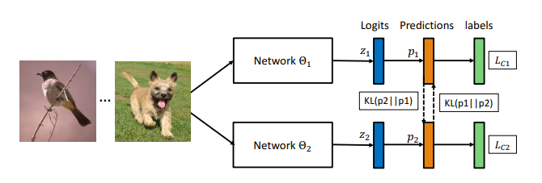

=================================
Deep Mutual Learning using KD_Lib
=================================

`Paper <https://arxiv.org/abs/1706.00384>`_

* Deep Mutual Learning is an *online* algortihm wherein an ensemble of students learn collaboratively and teach each other throughout the training process.
* Rather performing a one way transfer from a powerful and large and pre-trained teacher network, DML uses a pool of untrained students who learn simultaneously to solve the task together. 
* Each student is trained with two losses: a conventional supervised learning loss, and a mimicry loss that aligns each student’s class posterior with the class probabilities of other students.

Snippet from the paper illustrating the DML algorithm -

To use DML with KD_Lib, create a list of student models (student cohort) to be used for collective training and a list of optmizers for them as well. 
The student models may have different architectures.
Remember to match the order of the students with that of their optimizers in the list.

To use DML with 3 students on MNIST -

.. code-block:: python

    import torch
    import torch.nn as nn
    import torch.optim as optim
    from torchvision import datasets, transforms
    from KD_Lib.KD import DML

    # Define datasets, dataloaders, models and optimizers

    train_loader = torch.utils.data.DataLoader(
        datasets.MNIST(
            "mnist_data",
            train=True,
            download=True,
            transform=transforms.Compose(
                [transforms.ToTensor(), transforms.Normalize((0.1307,), (0.3081,))]
            ),
        ),
        batch_size=32,
        shuffle=True,
    )

    test_loader = torch.utils.data.DataLoader(
        datasets.MNIST(
            "mnist_data",
            train=False,
            transform=transforms.Compose(
                [transforms.ToTensor(), transforms.Normalize((0.1307,), (0.3081,))]
            ),
        ),
        batch_size=32,
        shuffle=True,
    )

    # Set device to be trained on

    device = torch.device("cuda:0" if torch.cuda.is_available() else "cpu")

    # Define a cohort of student models

    student_model_1 = <your model>
    student_model_2 = <your model>                                          
    student_model_3 = <your model>

    student_cohort = (student_model_1, student_model_2, student_model_3)

    # Make a list of optimizers for the models keeping in mind the order

    student_optimizer_1 = optim.SGD(student_model_1.parameters(), 0.01)
    student_optimizer_2 = optim.SGD(student_model_2.parameters(), 0.01)
    student_optimizer_3 = optim.SGD(student_model_3.parameters(), 0.01)

    optimizers = [student_optimizer_1, student_optimizer_2, student_optimizer_3]

    # Train using KD_Lib

    distiller = DML(student_cohort, train_loader, test_loader, optimizers,
                    device=device)  
    distiller.train_students(epochs=5, plot_losses=True, save_model=True)   # Train the student cohort
    distiller.evaluate()                                                    # Evaluate the student models
    

