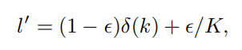

===========================================
Label Smooth Regularization using KD_Lib
===========================================

`Paper <https://arxiv.org/abs/1911.07471>`_

* Considering a sample x of class k with ground truth label distribution l = δ(k), where δ(·) is impulse signal,
the LSR label is given as -

 where K is the number of classes

To use the label smooth regularization with incorrect teacher predictions replaced with labels where the correct classes have a probability of 0.9 -

.. code-block:: python

    import torch
    import torch.nn as nn
    import torch.optim as optim
    from torchvision import datasets, transforms
    from KD_Lib.KD import LabelSmoothReg

    # Define datasets, dataloaders, models and optimizers

    train_loader = torch.utils.data.DataLoader(
        datasets.MNIST(
            "mnist_data",
            train=True,
            download=True,
            transform=transforms.Compose(
                [transforms.ToTensor(), transforms.Normalize((0.1307,), (0.3081,))]
            ),
        ),
        batch_size=32,
        shuffle=True,
    )

    test_loader = torch.utils.data.DataLoader(
        datasets.MNIST(
            "mnist_data",
            train=False,
            transform=transforms.Compose(
                [transforms.ToTensor(), transforms.Normalize((0.1307,), (0.3081,))]
            ),
        ),
        batch_size=32,
        shuffle=True,
    )

    # Set device to be trained on

    device = torch.device("cuda:0" if torch.cuda.is_available() else "cpu")

    # Define student and teacher models

    teacher_model = <your model>
    student_model = <your model>

    # Define optimizers

    teacher_optimizer = optim.SGD(teacher_model.parameters(), lr=0.01)
    student_optimizer = optim.SGD(student_model.parameters(), lr=0.01)

    # Train using KD_Lib

    distiller = LabelSmoothReg(teacher_model, student_model, train_loader, test_loader, teacher_optimizer, 
                               student_optimizer, correct_prob=0.9, device=device)  
    distiller.train_teacher(epochs=5)                                       # Train the teacher model
    distiller.train_students(epochs=5)                                      # Train the student model
    distiller.evaluate(teacher=True)                                        # Evaluate the teacher model
    distiller.evaluate()                                                    # Evaluate the student model
    

