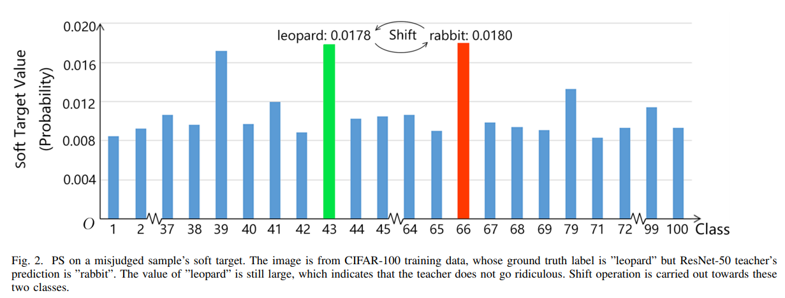

===========================================
Probability Shift using KD_Lib
===========================================

`Paper <https://arxiv.org/abs/1911.07471>`_

* Given an incorrect soft target, the probability shift algorithm simply swaps the value of ground truth (the theoretical maximum) and
the value of predicted class (the predicted maximum), to assure the maximum confidence is reached at ground truth label

To use the probability shift  algorithm to train a student on MNIST for 5 epcohs -

.. code-block:: python

    import torch
    import torch.nn as nn
    import torch.optim as optim
    from torchvision import datasets, transforms
    from KD_Lib.KD import ProbShift

    # Define datasets, dataloaders, models and optimizers

    train_loader = torch.utils.data.DataLoader(
        datasets.MNIST(
            "mnist_data",
            train=True,
            download=True,
            transform=transforms.Compose(
                [transforms.ToTensor(), transforms.Normalize((0.1307,), (0.3081,))]
            ),
        ),
        batch_size=32,
        shuffle=True,
    )

    test_loader = torch.utils.data.DataLoader(
        datasets.MNIST(
            "mnist_data",
            train=False,
            transform=transforms.Compose(
                [transforms.ToTensor(), transforms.Normalize((0.1307,), (0.3081,))]
            ),
        ),
        batch_size=32,
        shuffle=True,
    )

    # Set device to be trained on

    device = torch.device("cuda:0" if torch.cuda.is_available() else "cpu")

    # Define student and teacher models

    teacher_model = <your model>
    student_model = <your model>

    # Define optimizers

    teacher_optimizer = optim.SGD(teacher_model.parameters(), lr=0.01)
    student_optimizer = optim.SGD(student_model.parameters(), lr=0.01)

    # Train using KD_Lib

    distiller = ProbShift(teacher_model, student_model, train_loader, test_loader, teacher_optimizer, 
                    student_optimizer, device=device)  
    distiller.train_teacher(epochs=5)                                       # Train the teacher model
    distiller.train_students(epochs=5)                                      # Train the student model
    distiller.evaluate(teacher=True)                                        # Evaluate the teacher model
    distiller.evaluate()                                                    # Evaluate the student model
    

