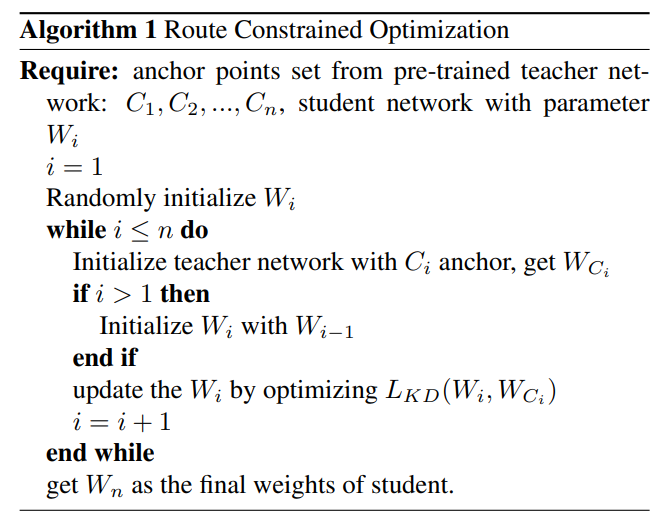

===========================================
Route Constrained Optimization using KD_Lib
===========================================

`Paper <https://arxiv.org/abs/1904.09149>`_

* The route constrained optimization algorithm considers knowledge distillation from the perspective of curriculum learning by routing
* Instead of supervising the student model with a converged teacher model, it is supervised with some anchor points selected from the route in parameter space that the teacher model passed by
* This has been demonstrated to greatly reduce the lower bound of congruence loss for knowledge distillation, hint and mimicking learning

To use RCO with the the student mimicking the teacher's trajectory at an interval of 5 epochs -

.. code-block:: python

    import torch
    import torch.nn as nn
    import torch.optim as optim
    from torchvision import datasets, transforms
    from KD_Lib.KD import RCO

    # Define datasets, dataloaders, models and optimizers

    train_loader = torch.utils.data.DataLoader(
        datasets.MNIST(
            "mnist_data",
            train=True,
            download=True,
            transform=transforms.Compose(
                [transforms.ToTensor(), transforms.Normalize((0.1307,), (0.3081,))]
            ),
        ),
        batch_size=32,
        shuffle=True,
    )

    test_loader = torch.utils.data.DataLoader(
        datasets.MNIST(
            "mnist_data",
            train=False,
            transform=transforms.Compose(
                [transforms.ToTensor(), transforms.Normalize((0.1307,), (0.3081,))]
            ),
        ),
        batch_size=32,
        shuffle=True,
    )

    # Set device to be trained on

    device = torch.device("cuda:0" if torch.cuda.is_available() else "cpu")

    # Define student and teacher models

    teacher_model = <your model>
    student_model = <your model>

    # Define optimizers

    teacher_optimizer = optim.SGD(teacher_model.parameters(), lr=0.01)
    student_optimizer = optim.SGD(student_model.parameters(), lr=0.01)

    # Train using KD_Lib

    distiller = RCO(teacher_model, student_model, train_loader, test_loader, teacher_optimizer, 
                    student_optimizer, epoch_interval=5, device=device)  
    distiller.train_teacher(epochs=20)                                      # Train the teacher model
    distiller.train_students(epochs=20)                                     # Train the student model
    distiller.evaluate(teacher=True)                                        # Evaluate the teacher model
    distiller.evaluate()                                                    # Evaluate the student model
    

