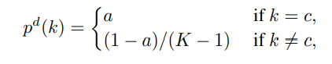

===========================================
Virtual Teacher using KD_Lib
===========================================

`Paper <https://arxiv.org/abs/1909.11723>`_

* A teacher is designed with 100% accuracy using label smoothening regularization
* The teacher model which outputs distribution for classes as the following -

where K is the total number of classes, c is the correct label and a is the correct probability for the
correct class

To use the virtual teacher algorithm with the correct classes assigned probabilities of 0.9 -

.. code-block:: python

    import torch
    import torch.nn as nn
    import torch.optim as optim
    from torchvision import datasets, transforms
    from KD_Lib.KD import VirtualTeacher

    # Define datasets, dataloaders, models and optimizers

    train_loader = torch.utils.data.DataLoader(
        datasets.MNIST(
            "mnist_data",
            train=True,
            download=True,
            transform=transforms.Compose(
                [transforms.ToTensor(), transforms.Normalize((0.1307,), (0.3081,))]
            ),
        ),
        batch_size=32,
        shuffle=True,
    )

    test_loader = torch.utils.data.DataLoader(
        datasets.MNIST(
            "mnist_data",
            train=False,
            transform=transforms.Compose(
                [transforms.ToTensor(), transforms.Normalize((0.1307,), (0.3081,))]
            ),
        ),
        batch_size=32,
        shuffle=True,
    )

    # Set device to be trained on

    device = torch.device("cuda:0" if torch.cuda.is_available() else "cpu")

    # Define student and teacher models

    student_model = <your model>

    # Define optimizer

    student_optimizer = optim.SGD(student_model.parameters(), lr=0.01)

    # Train using KD_Lib

    distiller = VirtualTeacher(student_model, train_loader, test_loader, student_optimizer, 
                             correct_prob=0.9, device=device)  
    distiller.train_student(epochs=5)                                       # Train the student model
    distiller.evaluate()                                                    # Evaluate the student model
    

